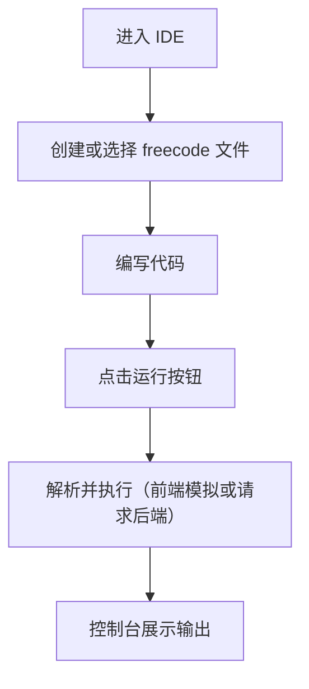

## 1. 产品概述
FreeCode Web IDE 是一款专为 "freecode" 语言/平台设计的轻量级、现代化的在线集成开发环境（IDE）。
- 主要目的是为 freecode 开发者提供一个开箱即用的沉浸式编程体验，降低环境配置门槛。
- 目标受众是需要快速编写、运行和调试 freecode 代码的用户。

## 2. 核心功能

### 2.1 用户角色
| 角色 | 注册方式 | 核心权限 |
|------|---------------------|------------------|
| 开发者 | 暂不需注册（本地缓存） | 编写代码、运行代码、管理本地虚拟文件 |

### 2.2 功能模块
1. **IDE 工作区**: 顶部工具栏、左侧文件树、中央代码编辑器、底部控制台。

### 2.3 页面详细信息
| 页面名称 | 模块名称 | 功能描述 |
|-----------|-------------|---------------------|
| IDE 主工作区 | 顶部工具栏 | 提供“运行（Run）”、“保存（Save）”、“清空控制台”、“设置”等全局操作按钮。 |
| IDE 主工作区 | 文件管理器 | 侧边栏支持新建、删除、重命名 freecode 脚本文件。 |
| IDE 主工作区 | 代码编辑器 | 支持 freecode 语法高亮（基于已有语法适配）、自动补全、行号显示。 |
| IDE 主工作区 | 底部控制台 | 显示代码运行输出结果、错误日志或调试信息。 |

## 3. 核心流程
用户进入 IDE -> 在侧边栏创建或选择文件 -> 在编辑器中编写 freecode 代码 -> 点击顶部“运行”按钮 -> 底部控制台输出运行结果。

## 4. 用户界面设计
### 4.1 设计风格
- 极客/专业风格（Geek/Professional Aesthetic）。
- 主色调为深色主题（Dark Theme），背景色为深灰/黑色（如 `#1E1E1E` 或 `#0D1117`），搭配高对比度的亮色强调色（如荧光绿或亮蓝色）以突出核心操作（如“运行”按钮）。
- 字体：代码区使用等宽字体（如 `JetBrains Mono` 或 `Fira Code`），UI 界面使用现代无衬线字体（如 `Inter` 或 `System UI`）。
- 布局：经典的三段式 IDE 布局（左侧边栏、中央编辑区、底部面板），面板之间支持拖拽调整大小。
- 交互：支持拖拽、悬停具有明显的视觉反馈（如变色或下划线），按钮点击带有微小缩放动画。

### 4.2 页面设计概览
| 页面名称 | 模块名称 | UI 元素 |
|-----------|-------------|-------------|
| IDE 主工作区 | 整体布局 | 采用 CSS Grid 或 Flexbox 实现的自适应全屏布局。面板分割线需有拖拽手势光标提示。 |
| IDE 主工作区 | 工具栏 | 极简图标按钮（使用 Lucide Icons），主行动按钮（Run）使用亮色填充。 |
| IDE 主工作区 | 代码编辑器 | 隐藏默认粗糙的滚动条，定制滚动条样式，高亮当前所在代码行。 |

### 4.3 响应式设计
桌面端优先。考虑到 IDE 的复杂性，屏幕较小时（如平板）支持折叠侧边栏并隐藏控制台，重点保留代码阅读和简单编辑功能；移动端以查看代码为主。
