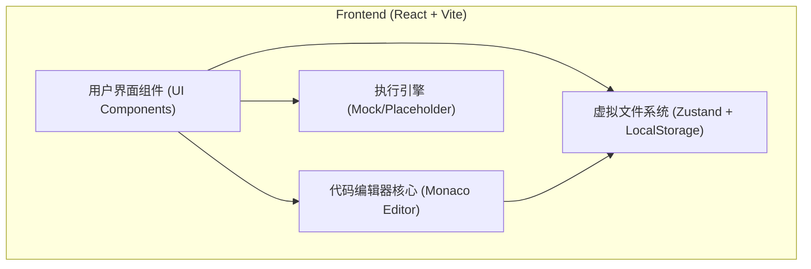
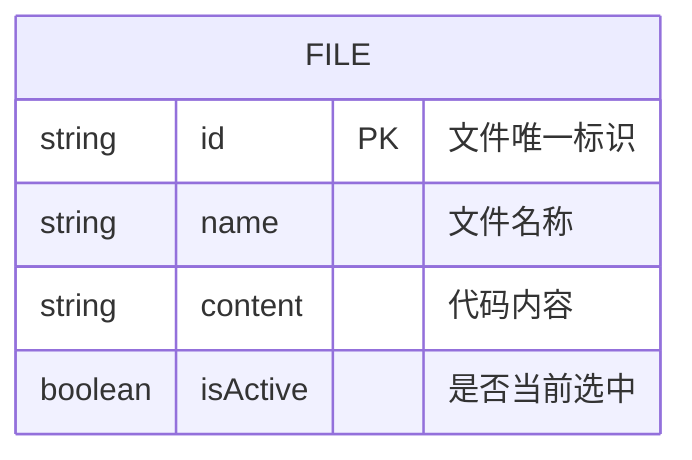

## 1. 架构设计


## 2. 技术说明
- 前端框架: React@18 + Vite
- 样式方案: Tailwind CSS v3 + Lucide React (图标组件)
- 核心组件库:
  - `@monaco-editor/react` (提供代码编辑器支持)
  - `react-resizable-panels` (提供可拖拽调整大小的面板布局)
- 状态管理: `zustand` (管理文件树状态、当前激活文件、终端输出状态)
- 数据持久化: `localStorage` (在浏览器本地保存用户代码数据)

## 3. 路由定义
| 路由 | 用途 |
|-------|---------|
| / | IDE 主工作区界面（单页应用，无其他路由） |

## 4. API 定义
本项目目前为纯前端应用，所有文件和状态保存在浏览器本地缓存中，暂无后端 API 依赖。freecode 的执行引擎暂时在前端通过模拟实现（例如输出占位符或通过 Web Worker 执行简单的解析逻辑）。

## 5. 服务器架构图
（纯前端架构，无后端服务器）

## 6. 数据模型
### 6.1 数据模型定义


### 6.2 数据定义语言
前端通过 TypeScript 接口定义虚拟文件状态：
```typescript
export interface IFile {
  id: string;
  name: string;
  content: string;
}

export interface IIDEState {
  files: IFile[];
  activeFileId: string | null;
  outputLogs: string[];
  addFile: (name: string) => void;
  updateFileContent: (id: string, content: string) => void;
  setActiveFile: (id: string) => void;
  deleteFile: (id: string) => void;
  runCode: () => void;
  clearLogs: () => void;
}
```
